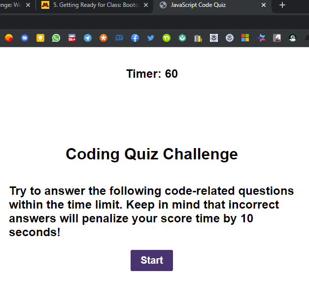
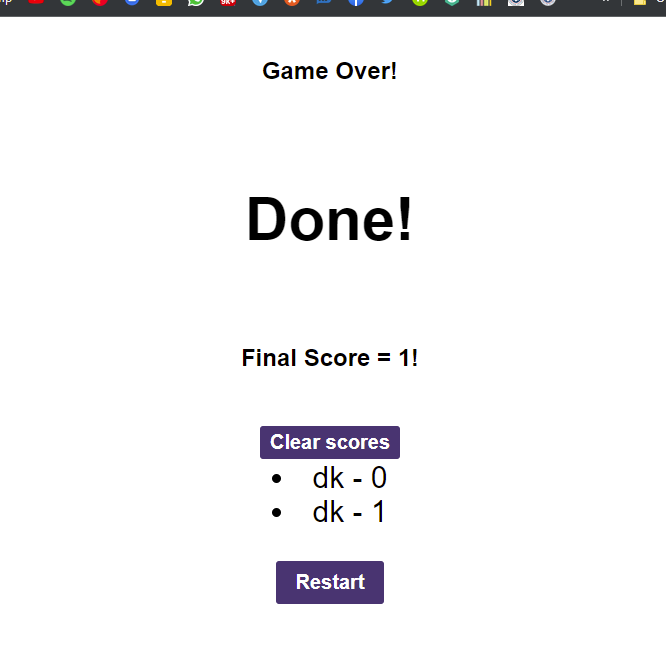

# C-4-Web-APIs_Code-Quiz

Targeted goals:

- Create an application: timed quiz that stores scores using JavaScript
- Click the Start Button will trigger a timer and first question will presented
- After answer the question, the next question should show up
- If correct add 1 point, add green color to the correct answer
- If wrong subtract 10 from timer, add red color to the wrong answer
- Game Over: timer stop and user can save initials and score

## Application deployed at URL:

https://kakudiego.github.io/C-4-Web-APIs_Code-Quiz/

## GitHub repository:

https://github.com/kakudiego/C-4-Web-APIs_Code-Quiz

### ScreenShots:

#### First screen

#### First question and timer

#### Initial and Score

